# [Interview task](https://github.com/derekwanclsa/interview-task)

## Overview

In this task, I would like you to conduct a small research project entirely from scratch. The task is representative of the work we do, and therefore:

- you will have a chance to demonstrate some of your relevant coding/mathematical skills.
- it is largely open-ended; you will have the freedom to structure the project as you see fit. Much like on-the-job.
- it is idealized; you may well find unexpected difficulties along the way, and your resourcefulness/outside-the-box-thinking will be needed. Again, much like on-the-job.
- Lastly, you will have a chance to see if this role truly interests you! (Yes, it matters!)

This is not a test of memorization. You are welcome to use Google, StackOverflow, whatever resources you may need. We do this on-the-job too.

## Task

Construct a simple trading signal on the [S&P100](https://en.wikipedia.org/wiki/S%26P_100), and then run it through a backtest. Present its PnL and any relevant risk/reward metrics you wish.

_Note_: The signal does not need to carry any IP (intellectual property). You can even implement [momentum](<https://en.wikipedia.org/wiki/Momentum_(technical_analysis)>) as described by Wikipedia. In fact, do this, if you have no prior trading experience.

You will need to fetch the data to support this work yourself. [yfinance](https://github.com/ranaroussi/yfinance) is the go-to package (and has already been added to the environment by default). If you know something else, feel free to use it. If not, then you will be tested on how quickly you can pick up new tools of the trade.

You will need to conduct your analysis with [pandas](https://github.com/pandas-dev/pandas) and to present it with [jupyter](https://github.com/jupyterlab/jupyterlab/). Be sure to include some charts, using any visualization library of your choice.

Simplifying assumptions:

- The period of time can be anytime to anytime.
- The universe over the period of time can be assumed to be constant, with the same constituents as those in the S&P today.

Feel free to make further simplifying assumptions - they are not forbidden. Just be prepared to explain why you did it.

## Setup

Very little is fixed. You must use:

- this current Windows machine.
- [GitHub](https://github.com/) to host the code.

Other than these, everything else is welcome; we each have our own development environment after all. Given time is limited, this may well be infeasible. Hence, the following are also provided:

- [conda](https://docs.conda.io/en/latest/), a Python environment manager.
- [PyCharm](https://www.jetbrains.com/pycharm/), a Python IDE.

### GitHub

Let us set up everything up now.

- Log into [GitHub](https://github.com/) as `derekwanclsa`.

  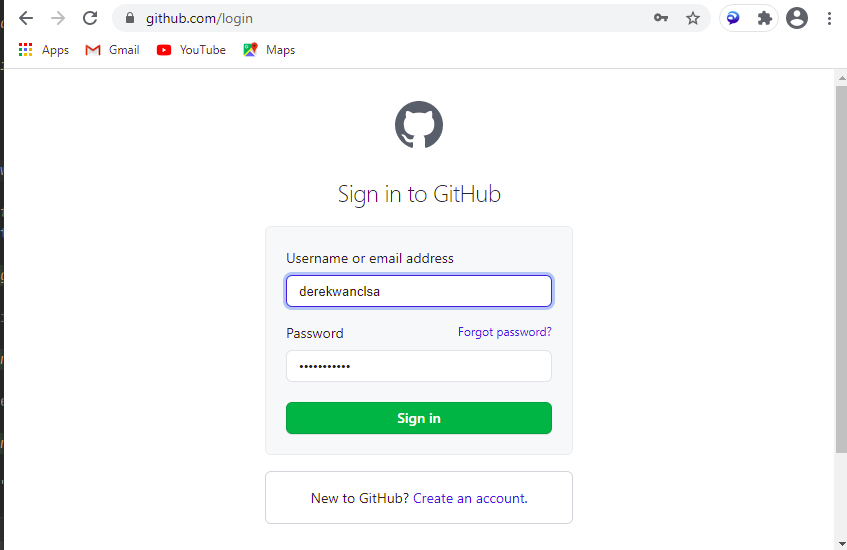

- Create a new repo:

  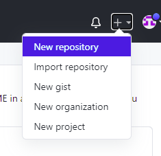

- Make sure to use the `interview-task` template, and to name it after yourself:

  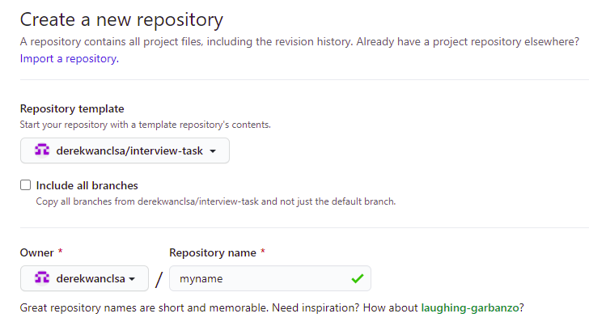

- Also make sure the repo is private:

  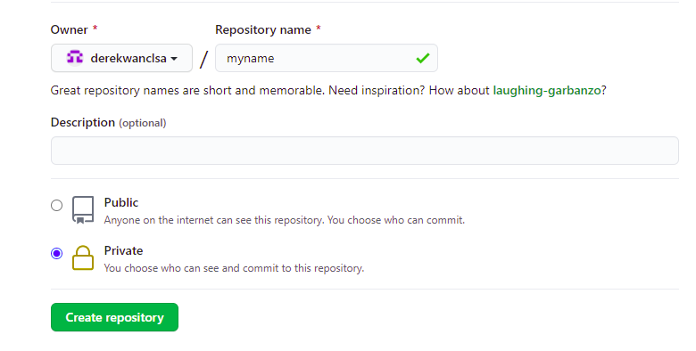

- Note that repo URL is under "Code" > "HTTPS":

  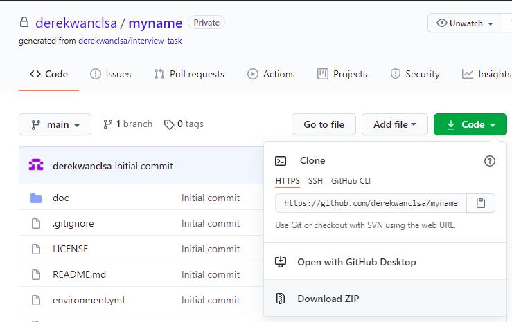

- Use `git bash` to clone the repo:

  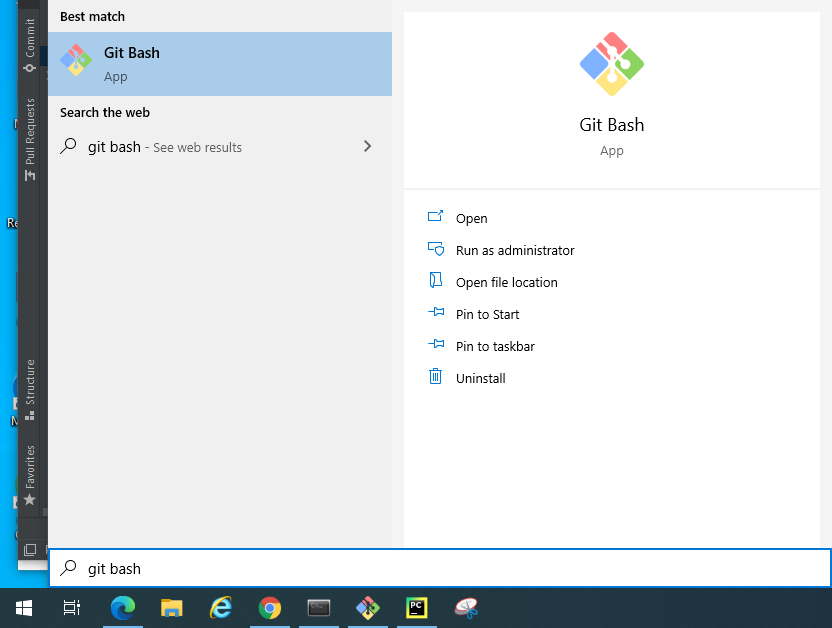

  Clone anywhere you want, for example, under `~/Documents/derekwan`:

  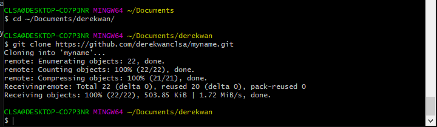

### conda

- Start `anaconda powershell prompt`:

  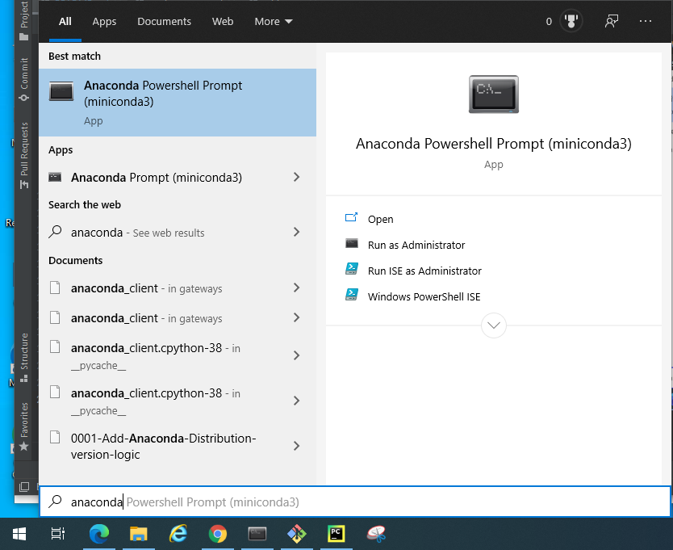

- Navigate to your repo and run `conda env create --force`:

  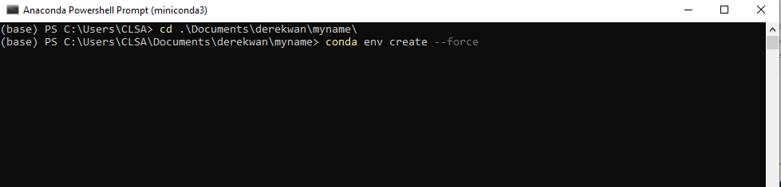

  After a minute or two:

  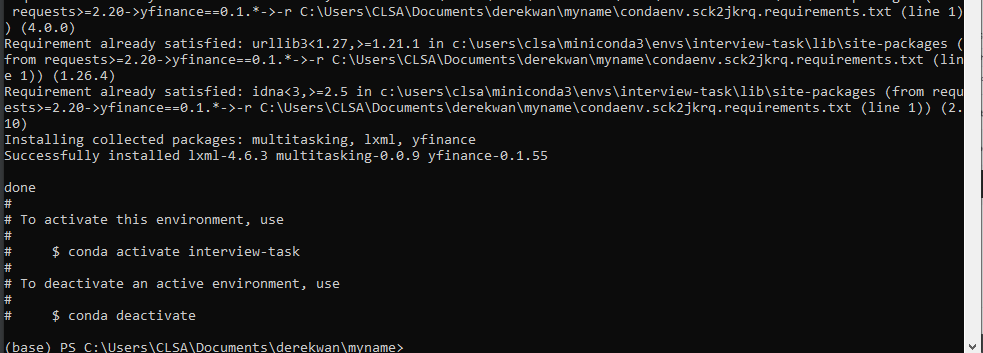

- Activate the environment with `conda activate interview-task`:

  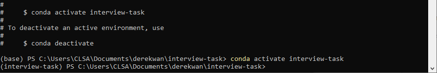

  You should see the prompt change to the `interview-task` environment.

If you wish to add packages:

- Add them to `environment.yml`:
  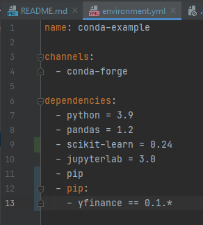
- Then run `conda env update`:
  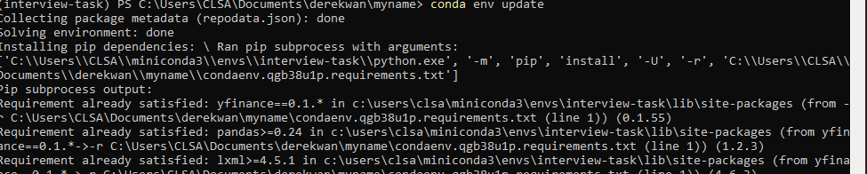
  After a minute or two:
  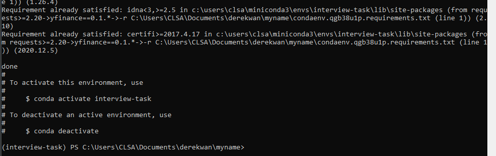

### PyCharm

- Start `PyCharm Community Edition`:

  

- Go to "Open":

  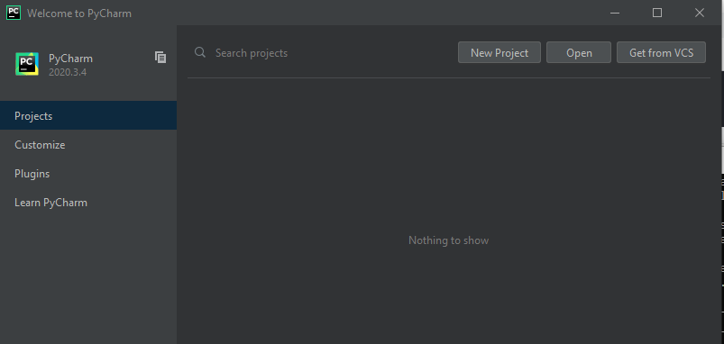

- Navigate to your repo:

  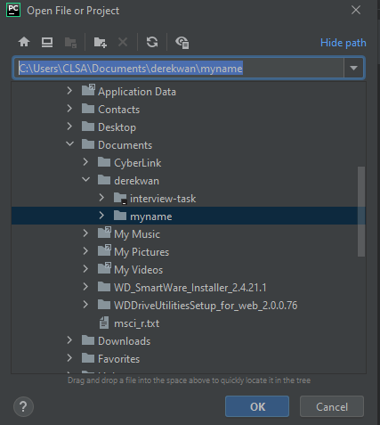

  You should see all existing files:

  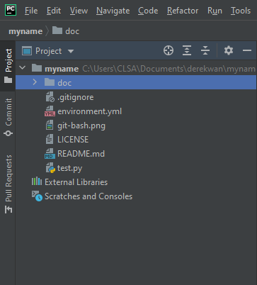

Next, we set up the interpreter.

- Go to "File" > "Settings":

  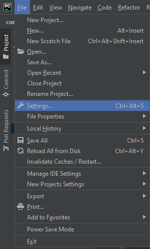

- Go to "Project: yourname" > "Project Interpreter" and hit the gears:

  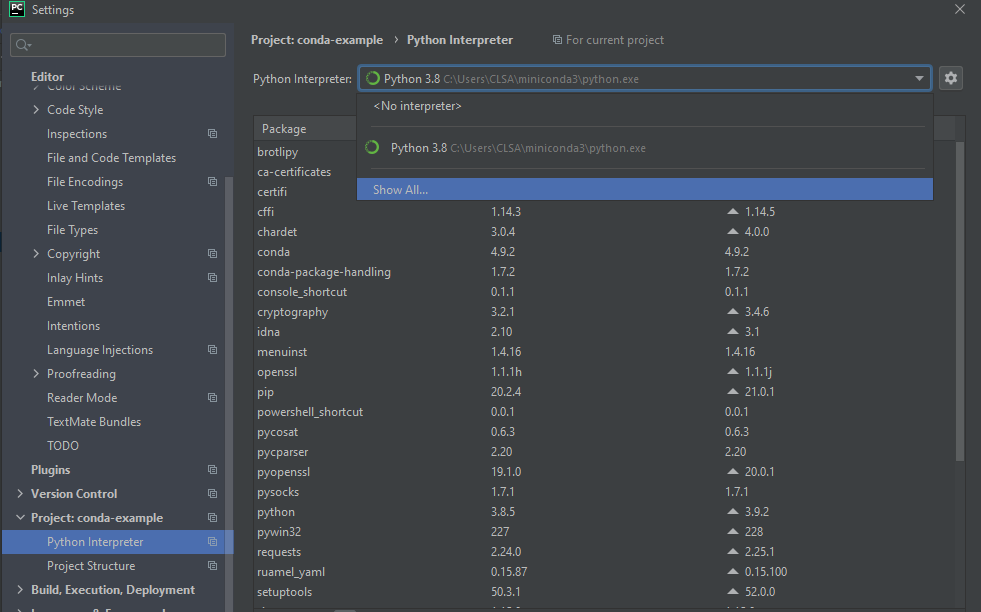

- Go to "Add":

  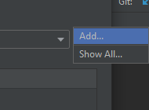

- Go to "Conda Environment" > "Existing environment" and then expand the list of interpreters:

  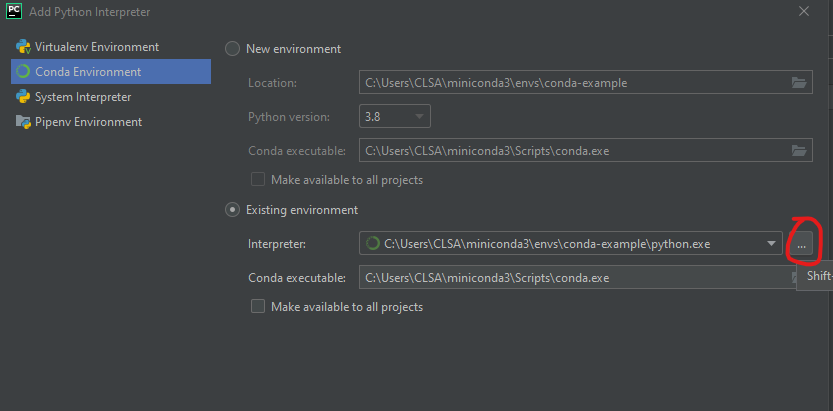

- Select `python3.exe` under the `miniconda3\envs` folder:

  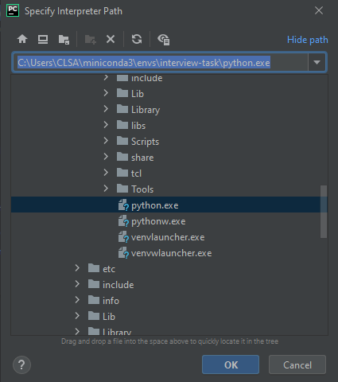

- Double check you have added the environment correctly:

  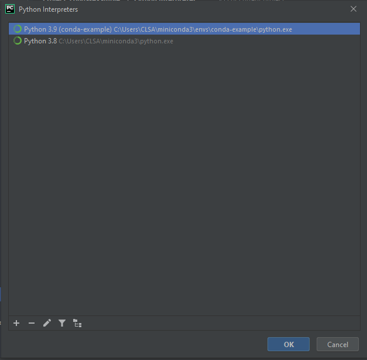

- PyCharm should now be linked to the environment, providing auto-completions and everything else:

  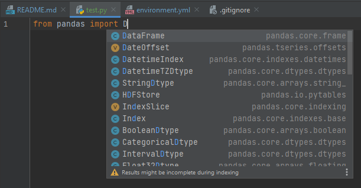

### Jupyter

This can be launched from the Anaconda prompt. Make sure you have your environment activated.

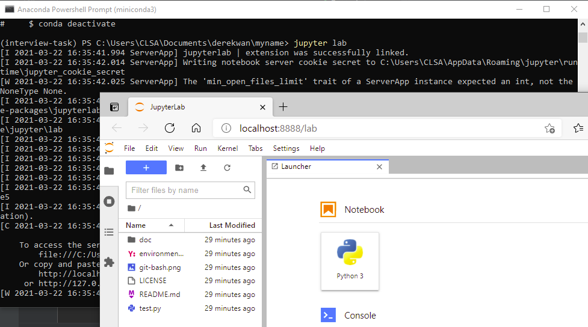
